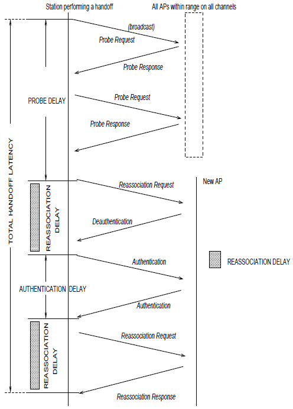
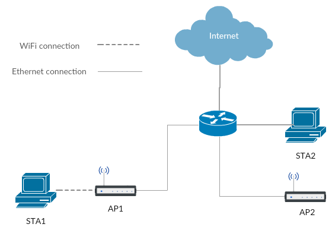
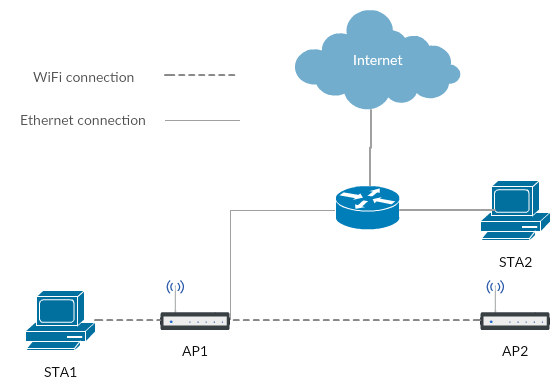
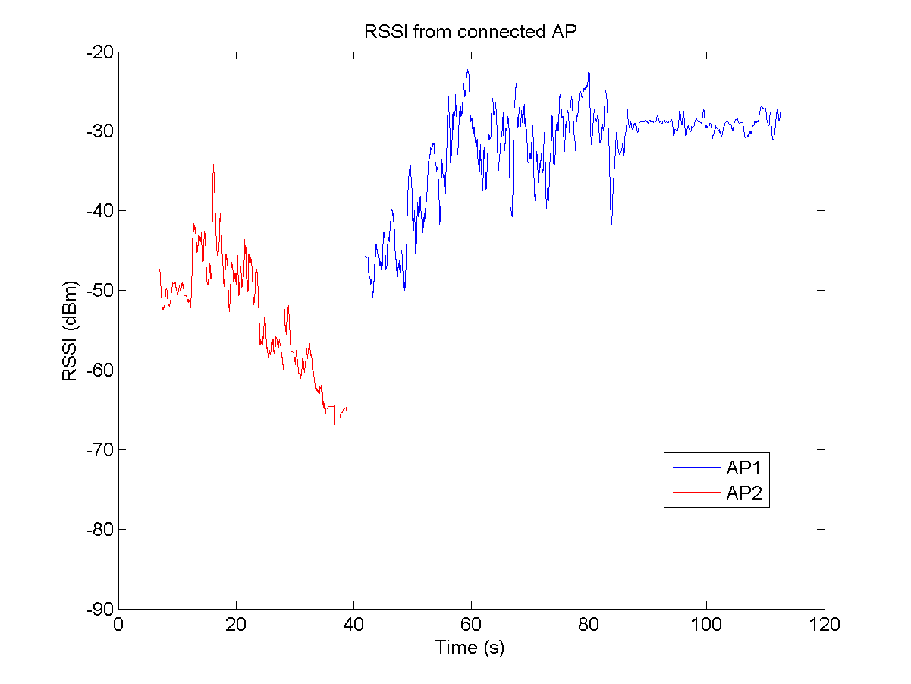
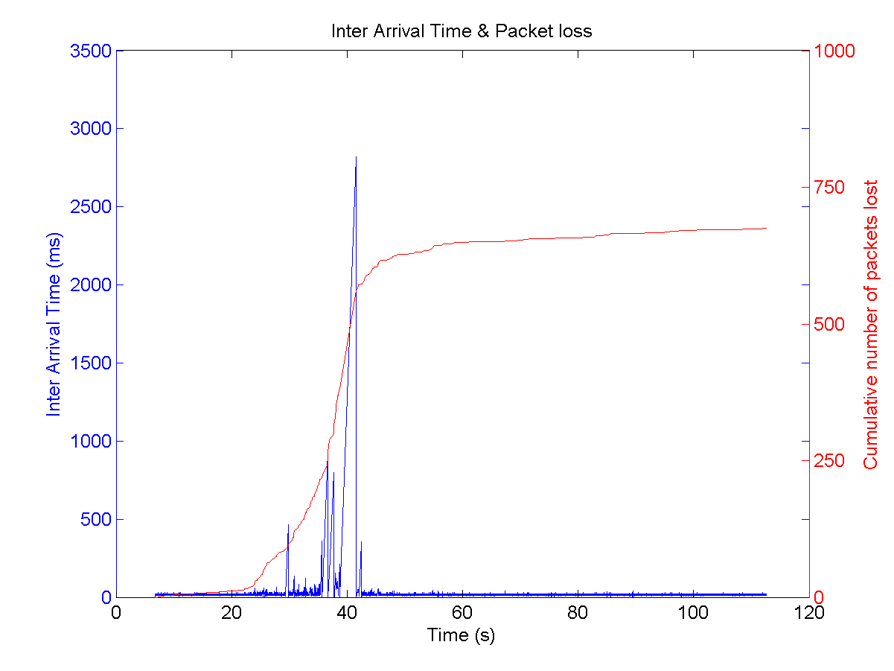
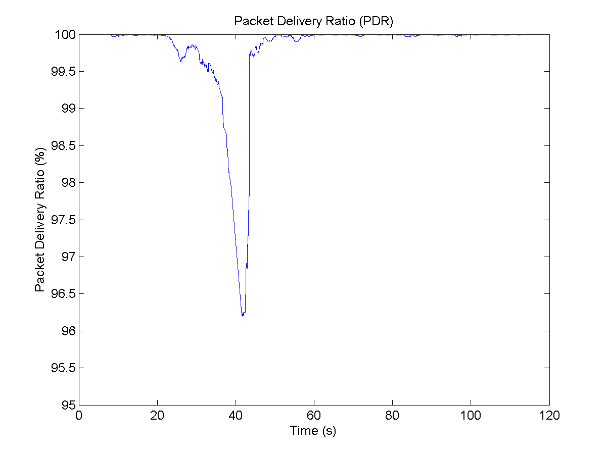
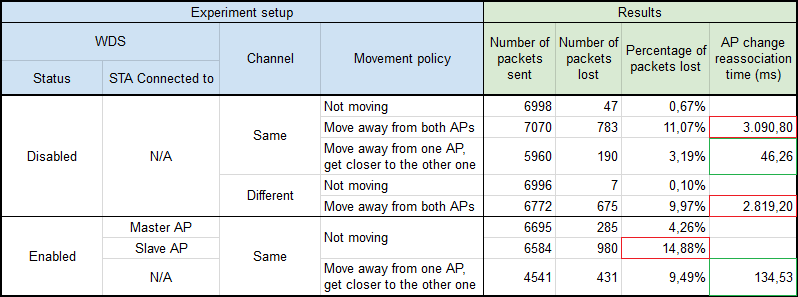

# WiFi traffic analytics

Real-time applications have strong requirements in terms of latency, which may be compromised in some environments. We have a real use case in a 7.7 km tunnel with several access points (APs). There are several stations (STAs) running a real-time application which must not exceed **150 ms** of latency time. These STAs are constantly moving along the tunnel.

In this project the impact of the **handoff** process in the latency in different situations is analyzed. This is triggered when an STA (connected to the WiFi network inside the tunnel) gets away from its current AP while getting closer to another AP. The purpose is to check whether the 150 ms requirement is met when the STA is performing the handoff. Please, find below how the usual handoff process would look like in terms of frames:

## Source code

[udp_send.py](scripts/udp_send.py) can be tweaked to send UDP packets from one STA to another one.

[SEU_Stats.m](scripts/SEU_Stats.m), [csvToMat.m](scripts/csvToMat.m) and [customhex2num.m](scripts/customhex2num.m) can also be used to process all metrics obtained by Wireshark.

## Results

A series of experiments have been conducted with two different setups. The first one is the regular one, where two APs are connected to the router via Ethernet, like shown in image below:

For the second setup, WDS has been enabled to allow one AP to be the master (connected to the router via Ethernet) and the other one to be the slave (connected to the master via WiFi), like shown in the image below:

The graphs analyzing several parameters for all experiments can be found under the [img](img) folder. The following graphs show these graphs for one of the experiments:

The following table shows the summary of the results, depending not only on above setup but also on the WiFi channel and the movement done by the STA:

## References

* Mishra, A., Shin, M., & Arbaugh, W. (2003). *An empirical analysis of the IEEE 802.11 MAC layer handoff process*. ACM SIGCOMM Computer Communication Review, 33(2), 93-102.
* Grunenberger, Y., & Rousseau, F. (2010, April). *Virtual access points for transparent mobility in wireless LANs*. In Wireless Communications and Networking Conference (WCNC), 2010 IEEE (pp. 1-6). IEEE.
* Sequeira, L., de la Cruz, J. L., Ruiz-Mas, J., Saldana, J., Fernandez-Navajas, J., & Almodovar, J. (2017). *Building an SDN enterprise WLAN based on virtual APs*. IEEE Communications Letters, 21(2), 374-377.
